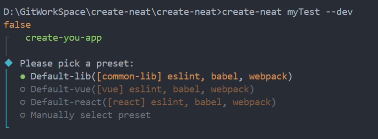
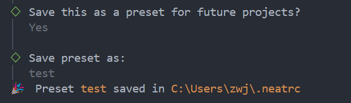
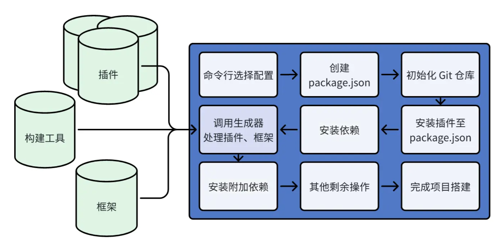

# Generator过程
`Generator` 是一个类，处理了框架、构建工具、插件等内容，是整个项目创建的核心，框架、插件都需要借助生成器Generator，将相关的文件、配置进行注入。

## 创建 package.json

### 初始化配置文件基本内容

控制台输出蓝色提示人员键入信息，并根据其生成 `package.json` 文件。

如图所示，本项目脚手架具有默认推荐配置，可一键安装相应预设配置方便开发。同时脚手架也提供手动选择模式，根据开发人员需求进行选择，可选择开发框架、开发语言、构建工具、`JS/TS`编译器、普通插件、特殊插件、包管理器、 `npm` 源等。其中普通插件则为 `prettier` 、 `eslint` `、husky` 等。可根据不同的框架推荐不同的路由插件及状态管理库，同时可以选择插件配置文件生成位置在不同的配置文件中或者在 `package.json` 中。根据这些用户选择将生成预设 `preset` 。生成之后会提示是否保存成自定义的预设配置，如若需要保存则将用户自定义预设保存到框架配置文件中。其内部通过将通过读取 `.neatrc` 文件读取脚手架固有预设配置，通过将自定义预设配置名称及所选择出要保存的自定义 `preset` 保存至框架预设对象中，使得用户在下一次构件时可选择保存的自定义预设选项，如图所示。

然后需要构建的配置文件基本内容包含了基本的配置例如项目名称、版本、是否私有、开发依赖和脚本等字段 `packageContent` 信息的对象，并进行了初始化。根据构建工具类型进行不同的操作。类型为 `webpack` 则复制整个目录到目标目录。如果复制成功输出完成信息。如果复制错误，则捕获错误并输出错误。

### 初始化构建工具配置文件

首先从 `buildTool.config.ejs` 中读取读取并返回文件内容,获取 `ejs` 格式的原始配置文件，其次借助 `ejs.render` 根据所选框架、构建工具等预设信息对 `ejs`  格式文件进行渲染。`EJS` (Embedded JavaScript Templates)是一种通过使用嵌入式 `JS` 代码来动态生成 `HTML` 网页的模板引擎。根据此种特性可以在项目构建阶段传递更为灵活的数据给到模板引擎，实现视图层与数据层的分离，最终生成符合预期的 `HTML` 结果。通过对解析出来的文件生成初始 `ast` 语法树，用于后续合并配置并生成真实的构建工具配置文件。目前 `create-neat` 项目使用`babel/parser`包进行解析。根据构建工具类型选取不同的命令行语句为 `package.json` 生成不同的 `scripts` 脚本。

### 插入插件依赖

根据所选 `plugins` 中的依赖版本号进行处理，若没有版本号则选取最新版本号。并将插件以开发环境依赖安装。特殊地，团队为 `babel` 插件集成了适用于项目的插件包，在使用过程中会使用`babel-plugin-test-ljq`包代替。然后根据项目的根路径创建可创建 `package.json` 文件的 `PackageAPI` 实例。其实例收集所有需创目录后异步创建所有目录，并行写入所有文件。然后初始化 `Git` 仓库。若目前为生产环境的话根据所创建 `package.json` 安装所有生产依赖以及开发依赖。

## Generator生成

在Generator生成流程中，处理了框架、构建工具、插件等内容，是整个项目创建的核心，框架、插件都需要借助生成器Generator，将相关的文件、配置进行注入。为承载这一流程执行，设计了 Generator 类，相关的执行逻辑都在 Generator.generate 中执行。

控制台提示生成信息辅助使用者明确脚手架开始构建。
脚手架根据根路径、插件、包内容、模板及选项配置对象创建 `Generator` 类，并根据额外配置文件调用 `generate` 方法进行生成。
类创建过程中，创建所有 `plugin` 和 `template` 的相关文件。由于不同插件之间对 `ts` 环境要求的配置不同，故需判断是否具备 `ts` 开发环境。为每个 `plugin` 创建 `GeneratorAPI` 实例，调用插件中的 `generate` 方法。在处理单个插件时，根据环境变量加载 `plugin` ，若加载结果为函数则执行。将框架需要的依赖添加到 `package.json` 中，以及如果该框架需要添加构建工具配置属性，则借助 `ast` 进行添加。根据 `template` 路径创建文件树实例，并使用 `ejs` 将文件树渲染到指定目录下形成文件。 此部分跳转[文件树生成](file-tree-processing.md)部分。

## 构建工具配置文件生成

构建工具配置文件生成，将由构建工具配置的 `ast` 转换为代码，并写入至构建工具配置文件中。根据选择的框架的模板路径使用文件树对象进行渲染，至此与构建工具有关的配置全部添加完毕，后续需要生成构建工具配置文件。
使用 `babel` 的 [`generator`](https://babel.nodejs.cn/docs/babel-generator/) 方法可以将 `ast` 转换为代码。然后在根路径将构建工具配置文件例如 `webpack.config.js` 中写入转换的代码。

当用户选择在具体的配置文件中生成相应的配置项而不是在 `package.json` 中时，需要通过 `extra()` 函数具体生成不同的配置文件。同时需要考虑所生成的 `xxx.config.js/json` 文件是否在前步骤插入插件中已增加到 `package.json` 文件中，如若存在这样的插件需要将目前的 `package.json` 文件中相应的配置项删除，并在目标根目录增加相应的 `xxx.config.js/json` 文件填写相应内容。
如果用户选择配置在 `package.json` 中，则只需生成 `babel` 和 `swc` 编译器的配置文件。 `extra()` 函数需要传入需要生成插件配置文件的名称。在`extra()` 函数中，我们将扩展配置文件、提前预置的插件对应的配置文件清单例如 `.swcrc` 、 `.eslint.js` 、 `.eslint.json` 等 、Vue项目的 `vue.config.js` 配置对象合并到 `ConfigTransforms` 中。当 `ConfigTransforms`存在 、插入插件存在 、原始 `package.json` 中不存在时，说明该配置文件是再执行 `generatorAPI` 之后添加到 `package.json` 中的，需要生成额外的配置文件。将所需渲染的配置文件添加到文件树中，在根目录并生成一系列文件。

因以上步骤中对额外具体配置文件的生成，`package.json` 中有冗余插件配置，需要重写 `package.json` 文件，并向根文件树中添加该文件，消除 `generatorAPI` 中拓展 `package.json` 带来得副作用。而后创建目录及文件并安装 `package.json` 。

## 安装依赖及其他操作

根据 `package.json` 安装开发依赖及生产依赖。创建 `md` 文档，添加 `.gitignore` 文件，记录结束时间并计算打印输出构建时间及其他内容。