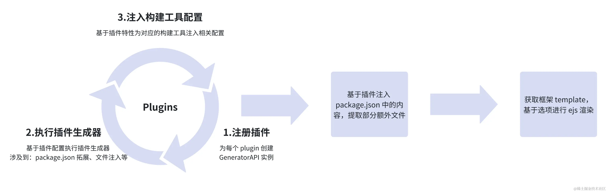

# Generator 过程

`Generator` 类处理了框架、构建工具、插件等内容，是整个项目创建的核心，框架、插件都需要借助生成器 `Generator` 将相关的文件、配置进行注入。

## 创建 package.json

### 初始化配置文件基本内容

本项目脚手架具有默认推荐配置，可一键安装相应预设配置方便开发。如下图所示，控制台输出提示键入信息，脚手架并根据其生成 `package.json` 文件。

如下所示，开发者也可根据需求手动选择不同插件满足多样化需求，特别地可以选择插件配置文件生成位置选择在独立的配置文件中或者在 `package.json` 中。

- 开发框架
- 开发语言
- 构建工具
- JS/TS 编译器
- 普通插件( prettier / eslint / husky )
- 特殊插件( 路由插件 / 状态管理库 )
- 包管理器
- `npm` 源

在手动选择模式下，脚手架根据用户选择的预设生成 `preset` ，同时提示是否保存成自定义的预设配置。如下图所示：若需要保存则将用户自定义预设保存到框架配置文件中。其内部通过将通过读取 `.neatrc` 文件读取脚手架固有预设配置，并将以上选择生成的 `preset` 保存至框架预设对象中，使得用户在下一次构建时可选择已保存的自定义预设模版。

以上需要构建的配置文件内容包括基本配置字段 `packageContent`对象，并对其初始化，其内容包括：

- 项目名称
- 版本
- 是否私有
- 开发依赖
- 脚本

同时根据构建工具类型进行不同构建操作。如当构建工具类型为 `webpack` 时复制整个目录到目标目录。如果复制成功输出完成信息。如果复制错误，则捕获错误并输出错误。

### 初始化构建工具配置文件

脚手架自构建工具配置文件的 `EJS` 文件中 读取内容 ，并借助 `EJS` 渲染生成初始 `ast` 语法树，用于合并配置并生成真实的构建工具配置文件。

`EJS` (Embedded JavaScript Templates)是一种通过使用嵌入式 `JS` 代码来动态生成 `HTML` 网页的模板引擎。根据此种特性可以在项目构建阶段传递更为灵活的数据给到模板引擎，实现视图层与数据层的分离，最终生成符合预期的 `HTML` 结果。

目前 `create-neat` 项目使用 `babel/parser` 包进行解析。且根据不同构建工具类型选取不同的命令行语句为 `package.json` 生成不同的 `scripts` 脚本。

### 插入插件依赖

在安装插件依赖过程中，脚手架将所选插件按照版本号插入以开发环境依赖安装。其中缺失版本号的插件选取最新版本号安装。根据项目的根路径创建用于生成 `package.json` 文件的 `PackageAPI` 实例。`PackageAPI`类如下所示：

- filePath  文件路径
- 创建/读取/更新/删除 `package.json` 文件的方法

其实例在收集所有需创目录后异步创建所有目录，并行写入所有文件。若目前为生产环境的话根据所创建 `package.json` 安装所有生产依赖及开发依赖。

## Generator 生成

在 `Generator` 生成流程中，处理了 `框架` 、 `构建工具` 、 `插件` 等内容，是整个项目创建的核心，框架、插件都需要借助生成器 `Generator` ，将相关的文件、配置进行注入。为承载这一流程执行，设计了 `Generator` 类，相关的执行逻辑都在 `Generator.generate` 中执行。

`Generator` 类由根路径、插件、包内容、模板及选项配置对象创建，在实例化过程中创建所有 `plugin` 和 `template` 的相关文件，并根据额外配置文件调用 `generate` 方法生成。

一般情况使用 `Generator` 类时需插入多种 `plugin` ,而不同 `plugin` 之间对 `TS` 环境要求也不同，需要对其进行判断处理。
对于每个 `plugin` ，在创建 `GeneratorAPI` 实例后调用插件中的 `generate` 方法生成。
在处理每个 `plugin` 生成时，需根据环境变量加载 `plugin` ，若加载结果为函数则执行，并将框架需要的依赖添加至 `package.json` 中。
以及若该框架需要添加构建工具配置属性，则借助 `ast` 进行添加。根据 `template` 路径创建文件树实例，并使用 `ejs` 将文件树渲染到指定目录下形成文件。 此部分请阅读[文件树生成](file-tree-processing.md)。

## 构建工具配置文件生成

构建工具配置文件将由构建工具配置的 `ast` 转换为代码，并写入至构建工具配置文件中生成。根据选择的框架的模板路径使用 `文件树` 进行渲染，至此与构建工具有关的配置全部添加完毕，后续需要生成构建工具配置文件。
本项目在根路径将构建工具配置文件例如 `webpack.config.js` 中写入使用 `babel` 的 [generator](https://babel.nodejs.cn/docs/babel-generator/) 方法将 `ast` 转换后的代码完成配置。

当用户选择预设在具体的配置文件（如 `webpack.config.js`）中生成相应的配置项时，需要考虑所生成的 `xxx.config.js/json` 文件是否在前步骤插入插件中已增加到 `package.json` 文件中，如若存在这样的插件需要将目前的 `package.json` 文件中相应的配置项删除，并在目标根目录增加相应的 `xxx.config.js/json` 文件填写相应内容。

而当用户选择配置在 `package.json` 中，则只需生成 `babel` 和 `swc` 编译器的配置文件。 并将以下几部分合并到 `ConfigTransforms` 中。

- 扩展配置文件
- 提前预置的插件对应的配置文件清单例如 `.swcrc` 、 `.eslint.js` 、 `.eslint.json` 等
- Vue 项目的 `vue.config.js` 配置等

当满足以下条件时，说明该配置文件是再执行 `GeneratorAPI` 之后添加到 `package.json` 中的，需要生成额外的配置文件。将所需渲染的配置文件添加到文件树中，在根目录并生成一系列文件。

- `ConfigTransforms`存在
- 插入插件存在
- 原始 `package.json` 中不存在

在以上步骤有额外生成具体配置文件，导致 `package.json` 中有冗余插件配置，需要重写 `package.json` 文件，并向根文件树中添加该文件，消除 `GeneratorAPI` 中拓展 `package.json` 带来得副作用。最后创建目录及文件并安装 `package.json` 。

## 安装依赖及其他操作

脚手架根据 `package.json` 安装开发依赖及生产依赖。创建 `md` 文档，添加 `.gitignore` 文件，记录结束时间并计算打印输出构建时间及其他内容。
