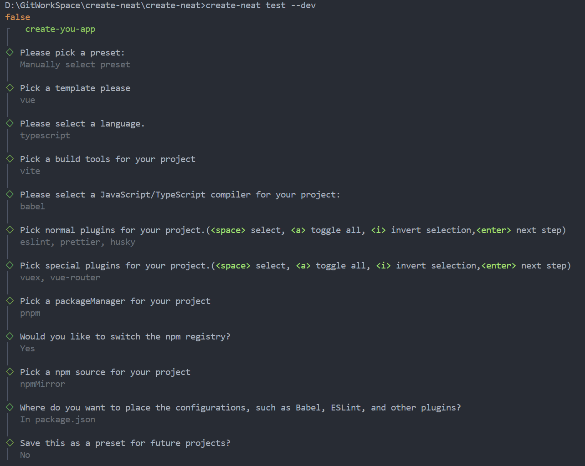

# 预设处理

## 获取用户预设

脚手架自创建空白用户选择预设开始，从用户系统文件夹中获取用户保存的配置。并将用户选择预设与空白预设覆盖合并，生成预设选项 `preset` 列表。以下为获取用户选择列表选项：

- 框架：框架是通常包含了许多预先编写好的代码，以及一些标准化的方法和规范，以便于开发者快速开发出复杂界面。目前提供的有 `vue` 、 `react` 、`common-lib` 等。
- 开发语言：目前提供有 `javascript` 及 `typescript` 。
- 构建工具：构建工具能够提高前端开发效率及质量，优化项目的性能和可维护性。目前提供有 `webpack` 、 `vite` 及 `rollup`。
- JS/TS 编译器：编译器可将 JavaScript 或 TypeScript 代码进行转换和处理，以适应不同的运行环境和开发需求。目前提供有 `babel` 、 `swc` 。
- 一般插件：目前提供有 `eslint` 、`prettier` 、 `husky` 。
- 特殊插件：目前 `vue` 提供有 `vuex` 及 `vue-router` 插件，目前 `react` 提供有 `mobx` 、`react-router` 及 `antd` 插件。未来将集成更多实用插件。
- 包管理器：包管理器用于方便地安装、管理和共享前端项目所需的各种依赖包。目前提供有 `pnpm` 、 `yarn` 、 `npm` 。
- 是否切换 `npm` 源：源是为 npm 包管理器提供包资源的存储和获取地址，以满足用户对各种包的需求。目前提供的源有 `npm` 、 `yarn` 、 `tencent` 、 `cnpm` 、 `taobao` 、 `npmMirror` 、 `Fastest source` 等。
- 配置文件生成位置：不同插件具备不同配置文件如 `xxx.config.js/json` 中或 `package.json` 中。
- 当前手动所选配置是否保存为未来项目预设：保存、不保存。
  
使用函数让用户选择预设配置。若用户没有选择预设配置，则让用户选择合适选项，如图所示，将所选择语言、编译器及插件合并到一个对象中，根据用户的选择生成最终的预设 `preset` 。最后，询问用户是否将此次预设保存到系统文件中，如果要保存，让用户输入保存的名称，并进行保存操作。如图所示选择时，当前所选择 `preset` 中显示为空对象, `generaotr` 为生成器。`generaotr` 实现插件的文件注入以及配置拓展。 `preset` 对象作为用户选择信息将会传入 `generator` 中影响并生成最终项目。

